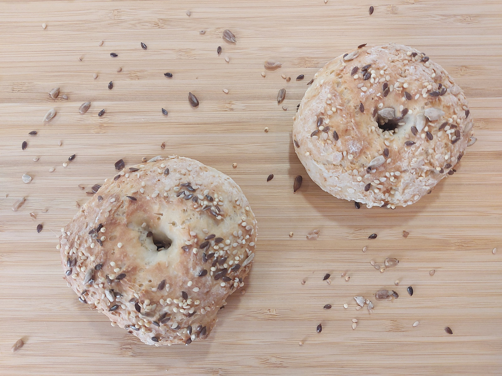

_Te olvidarás de comprar el pan y preferirás hacerlo en casa. Rápido, sencillo y súper crujiente._

> Riquísimos! – Lourdes López.

Nadie te había dicho antes que hacer pan con yogur era posible ¿verdad?. Pues aquí está, sano, sabroso y saludable. Recuerda, si quieres tener para varios días, puedes congelarlo.

## Bagels de yogur y semillas
## Ingredientes:
- 120gr de yogur natural
- 120gr de harina
- 1 cucharada de levadura química
- 1 pizca de sal
- Semillas al gusto (lino, mijo, sésamo, pipas de girasol, calabaza, etc.)

## Elaboración:
1. Mezcla todos los ingredientes hasta que se integren y no queden grumos. Debe de quedarnos una masa untuosa y pegajosa.
2. Imprégnate las manos con un poco de aceite y haz bolitas del tamaño que prefieras y más te guste (en nuestro caso, fueron dos grandecitas). Después, dibuja un agujero en medio como si fuera un donut o rosquilla.
3. Deja las bolitas en una bandeja de horno (con papel vegetal) y espolvorea las semillas, apreta contra el pan para que queden bien adheridas y no se suelten.
4. Hornea durante 20 minutos a 200ºC (el horno previamente calentado)-
5. ¡Ya está! Tu pan crujiente en unos minutos.

Si te animas a hacer este pan tan crujiente, queremos ver como te han quedado. Puedes hacerle variaciones, como por ejemplo: en lugar de añadir las semillas por encima, puedes incorporarlas a la masa para que por dentro también tengas ese toque crujiente.

Aguanta uno o dos días sin ponerse duro, el truco, cuando vayas a comerlo dale un toque de calor en el horno y está, ¡para chuparse los dedos!
