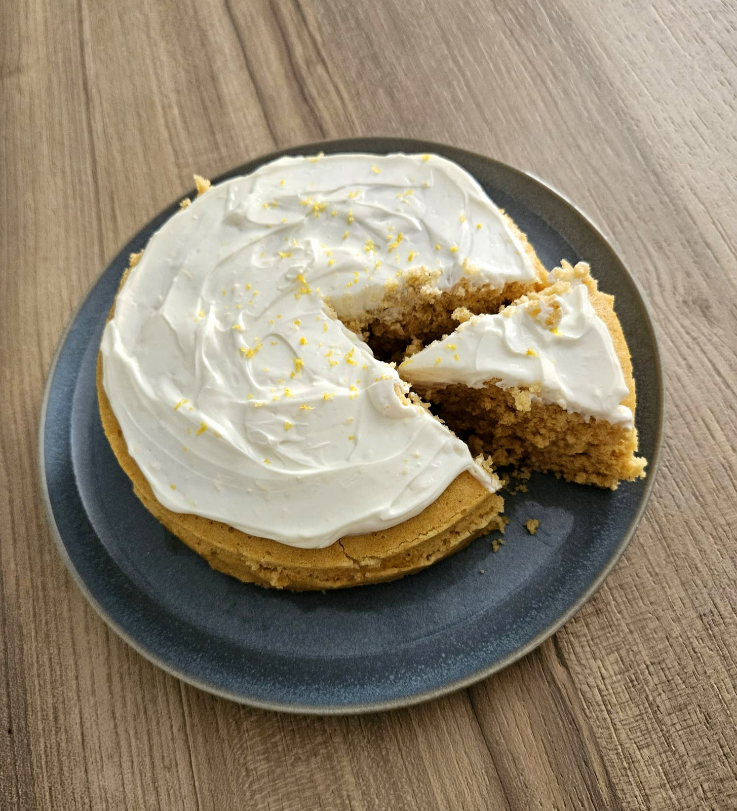

_¡Al micro en 5 minutos!_

> ¿Un bizcocho fresquito? Por supuesto.

Aquí tienes una receta saludable, sin azúcares y deliciosa.

## Bizcocho de limón

## Ingredientes:
- 3 huevos (L)
- 30ml de AOVE (Aceite de Oliva Virgen Extra)
- 30ml de zumo de limón
- 100gr de yogur desnatado
- 140gr de harina de avena
- 50gr de Eritritol
- 5-8gr de levadura
- Esencia de vainilla

## Elaboración:
1. Mezclamos en un vaso batidor los ingredientes húmedos (huevos, AOVE, zumo de limón, 100gr de yogur desnatado y Eritritol)
2. Cuando tengamos la mezcla, añadimos la harina de avena, la levadura y la esencia de vainilla
3. Mezclamos bien hasta que quede una mezcla homogénea y sin grumos
4. Vertemos en un molde para microondas
5. 4-5min a máxima potencia (dependerá de tu micro y tu molde)
6. Haz la prueba del palillo, si sale un poquito mojado... ¡Está en su punto!
7. Deja enfriar y decora
8. El topping que lleva por encima es: queso crema light y ralladura de limón
9. ¡A comer!

¡Consejo!

- Puedes hacerla al horno: 8-10min a 180ºC
