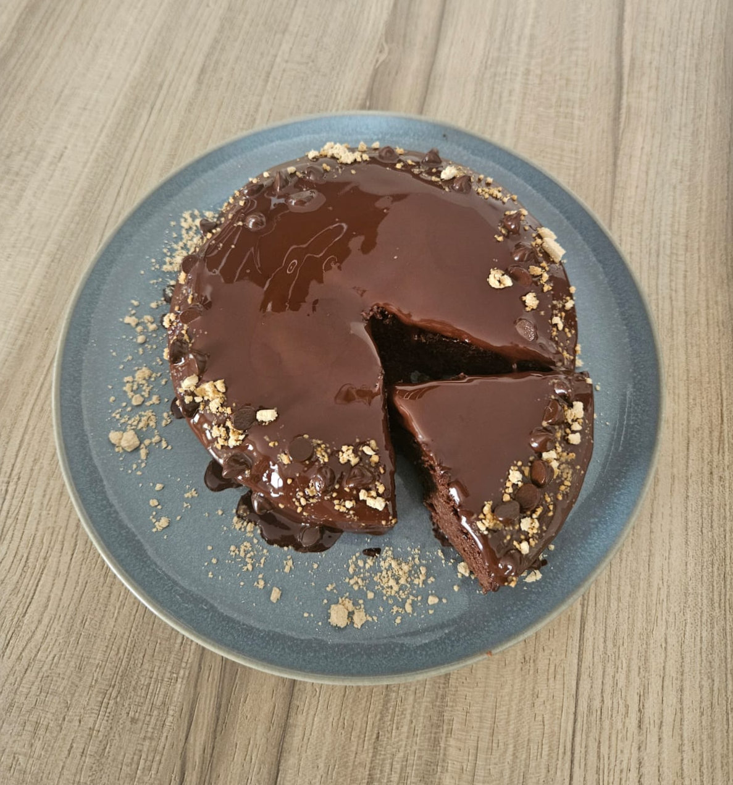

_¡Al micro en 5 minutos!_

> ¿Tienes antojo de chocolate y no sabes qué hacer?

Sin azúcar, rico, saludable y su base es la manzana

Te dejamos la video receta paso a paso, [aquí](https://www.tiktok.com/@vitalittynutri/video/7562154541689490710?is_from_webapp=1&sender_device=pc&web_id=7248299878596494875)

## Bizcocho de manzana y chocolate

## Ingredientes:
- 2 manzanas
- 20gr de cacao puro desgrasado
- 2 huevos
- 8gr de levadura
- 30gr de proteína (opcional)
- 80gr de harina de avena

## Elaboración:
1. Pelamos las manzanas y cortamos en dados
2. Vertemos todos los ingredientes en la batidora
3. Batimos hasta que quede una mezcla homogénea
4. Vertemos en un molde para microondas
5. 5min a máxima potencia (dependerá de tu micro y tu molde)
6. Haz la prueba del palillo, si sale un poquito mojado... ¡Está en su punto!
7. Deja enfriar y decora
8. Nuestros toppings, chocolate (+85%) derretido, chips de chocolate y cacahuete el polvo desgrasado
9. ¡A comer!

¡Consejo!

- Puedes hacerla al horno: 30min a 180ºC
- Puedes hacerla en la airfryer: 20min a 160ºC
