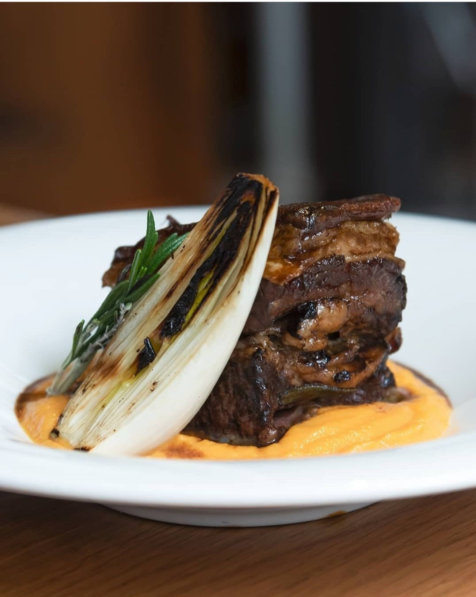

_¡Un lugar para volver a repetir sin duda!_

Es genial, perfecto para un _brunch_ y amigos. Recomiendo ir con hambre y con las orejas bien abiertas para escuchar las sugerencias del servicio, qué por cierto, súper amables. Ya es la segunda vez que vamos.

## Impresiones
[Diurno Madrid](https://www.diurno.com/) se encuentra en la calle de San Marcos, barrio de Chueca. El restaurante hace esquina y a primera vista, parece oscuro pero cuando te acercas la decoración es maravillosa. Te adentras en una biblioteca tenue y tranquila que esconde una rebeldía inquieta. La música es relajante y se nota que el cine marca su tendencia. La puerta de hierro enorme ya te adentra de lleno en el estilo industrial. Cocina super variada, desde lo más sencillo hasta los platos más creativos de la carta.

¡De noche es aún más bonito!

## Experiencia:
Diurno [Madrid](https://www.diurno.com/) se divide en dos zonas, las dos separadas por una escalera donde se ubica el baño con una cortina. Siempre hemos estado en la sala principal y es mucho más bonita, la decoración llama a la tranquilidad.

El servicio te recibe con un pan rustico caliente y con humus casero. Para abrir boca es maravilloso y suficiente como para quitarte el hambre hasta que vienen los demás platos. Además, te sugieren algún plato o preparación del día fuera de carta y te aconsejan si estas dudoso entre dos platos.

## Nuestros platos y opiniones:
**Entrante:**

En la primera visita: Gyozas de pato y verduras con salsa dulce de chiles- (10.5€)

En la segunda visita: Croquetas de jamó ibérico y salsa mayo chipotle - (10€)

Ambos entrantes estaban de miedo, ojalá vinieran más gyozas y croquetas en la ración. Las dos salsas le dan el toque. Nos recomendaron las alcachofas, así que la próxima vez las probaremos sin duda.

**Principales:**

En la primera visita: Canelones de carrillera ibérica con setas shiitake y salsa de queso ricotta y trufa - (13.5€) y Bacalao a baja temperatura, salteado de setas, trigueros y salsa romesco - (17€).

En la segunda visita: Costilla de ternera glaseada a baja temperatura con puré de boniato y cebolleta asada- (16.5€), y Lomo bajo de ternera angus fileteado con patatas fritas, tomate raf confitado y cebolleta asada- (21.5€).

¡Los canelones los comería todos los días!, de hecho, la segunda vez que acudimos ya íbamos pensando en que ese plato iba a ser reelegido. Las shiitake nos pierden y la mezcla de ricotta y trufa siempre es bienvenida. En cuanto al pescado, jugoso en su punto y con un sabor muy real.

El punto de las carnes muy bueno y en su punto. El glaseado de la costilla maravilloso, el toque dulce del boniato y el picor de la cebolleta encajan muy bien, y si mezclas todo es una explosión de sabor. El lomo alto muy bueno, es un plato más simple que si está bien cogido el punto de la carne, se acierta fácil.

**Postre:** tarta doble de chocolate (sin harina) - (6€) y tarta de queso con coulis de frutos rojos (6.5€).

Nos llamó muchísimo la atención que la tarta de chocolate fuera sin harina, así que decidimos pedirla y para nuestra sorpresa estaba super buena y además la sirven calentita. La tarta de queso jugosa, untuosa y rica. Ninguno de los dos postre era empalagoso, así que un acierto.

[Carta Diurno Madrid](https://www.diurno.com/carta/)

[Carta Brunch Diurno Madrid](https://www.diurno.com/brunch/)

Pd: puede parecer mucha comida, pero os contamos los platos elegidos de las dos veces que hemos ido.

## Puntuación final:
¡Un 8.75! Notable alto. En primer lugar, recalcar el servicio, ambas veces nos atendió el mismo chico y es un lujo. De hecho, le comentamos que daba gusto que te atendieran de esa manera Muy agradable todas las recomendaciones y los platos tremendos. ¡Muy buenos!

Os comparamos las dos veces que hemos ido, la primera fue entre semana y en pareja, los platos salieron con rapidez, muy cuidados y ricos, la segunda vez fue en fin de semana y con amigos, obviamente el local estaba mucho más lleno, haciendo esperar entre plato y plato algo más de lo normal, pero fue totalmente entendible. De hecho, debido a la espera y gratuitamente nos sirvieron una ración de la sugerencia del día. Todo un detalle y gesto por su parte. Nos hubiera gustado repetir los canelones pero se les habían acabado.
