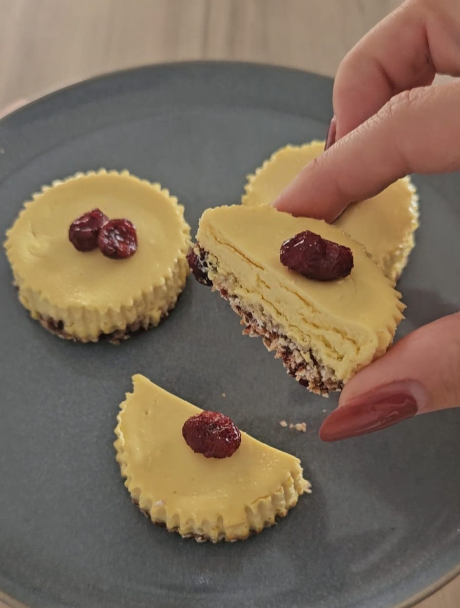

_Con base de arándanos y copos de avena. ¡Deliciosas!_

> ¿Amante de las tartas de queso?

Aquí tienes una receta saludable, baja en grasas y en versión mini, para que puedas darte un capricho riquísimo.

## Mini Cheesecake

## Ingredientes:
Crema:

- 2 huevos
- 400gr de queso crema light o 350gr de queso crema light + 50gr de yogur griego light
- Edulcorante
- Esencia de vainilla

Base:

- 60gr de copos de avena (ligeros o pequeños)
- 80gr de arándanos deshidratados

## Elaboración:
1. Trituramos los copos de avena con los arándanos
2. Debe de quedar una masa pegajosa
3. Repartimos la base en un molde para magdalenas y apretamos para que quede compacto
4. Llevamos a la nevera
5. Precalentamos el horno a 160-170ºC
6. A continuación mezclamos en un bol los huevos, el queso crema light, el edulcorante y la esencia de vainilla
7. Batimos bien para que no queden grumos
8. Sacamos de la nevera las bases y vertemos la mezcla a partes iguales
9. Metemos en el horno durante 25min
10. Sacamos y dejamos enfriar
11. ¡Voilá! riquísimas.

¡Consejo!

- Opcional: puedes añadir toppigs encima, como pistachos
- Si quieres cambiar los arándanos, puedes hacerlo por dátiles deshuesados (60gr) u otra fruta deshidratada.
