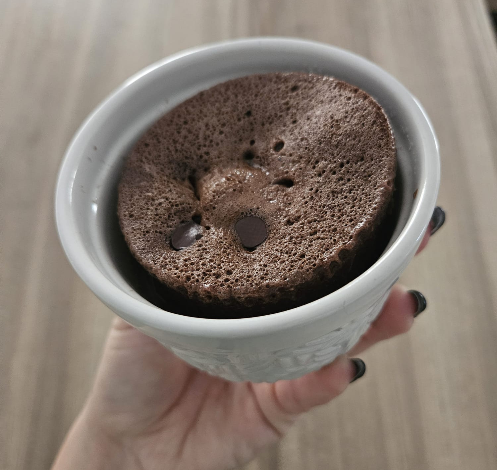

_Para los amantes del chocolate._

> ¿Quieres un postre en 1 minuto? Aquí está

Es súper fácil de hacer, y con ingredientes que podemos tener en casa habitualmente. Sano, rico y salvador de los momentos en los que necesitamos dulce.

Te dejamos la video receta paso a paso, [aquí](https://www.tiktok.com/@vitalittynutri/video/7476450651417939222?is_from_webapp=1&sender_device=pc&web_id=7248299878596494875)

## Mug cake de chocolate

## Ingredientes:
- 1 huevo
- 2 cucharadas de harina de avena
- 2 cucharadas de cacao puro
- 1 cuchara de AOVE (Aceite de Oliva Virgen Extra)
- 2 cucharadas de leche desnatada o vegetal
- Edulcorante al gusto
- Onza de chocolate (+75%)

## Elaboración:
1. Mezclamos todos los ingredientes, hasta tener una mezcla homogénea.
2. Verter en un recipiente apto para microondas.
3. Añadimos una onza de chocolate puro en el centro.
4. Llevamos al micro, 1 minuto o máxima potencia.
5. ¡A disfrutar! Está de muerte

¡Consejo!

- Opcional: añadir 15gr de proteína.
- Opcional: añadir chips de chocolate al sacar del microondas.
