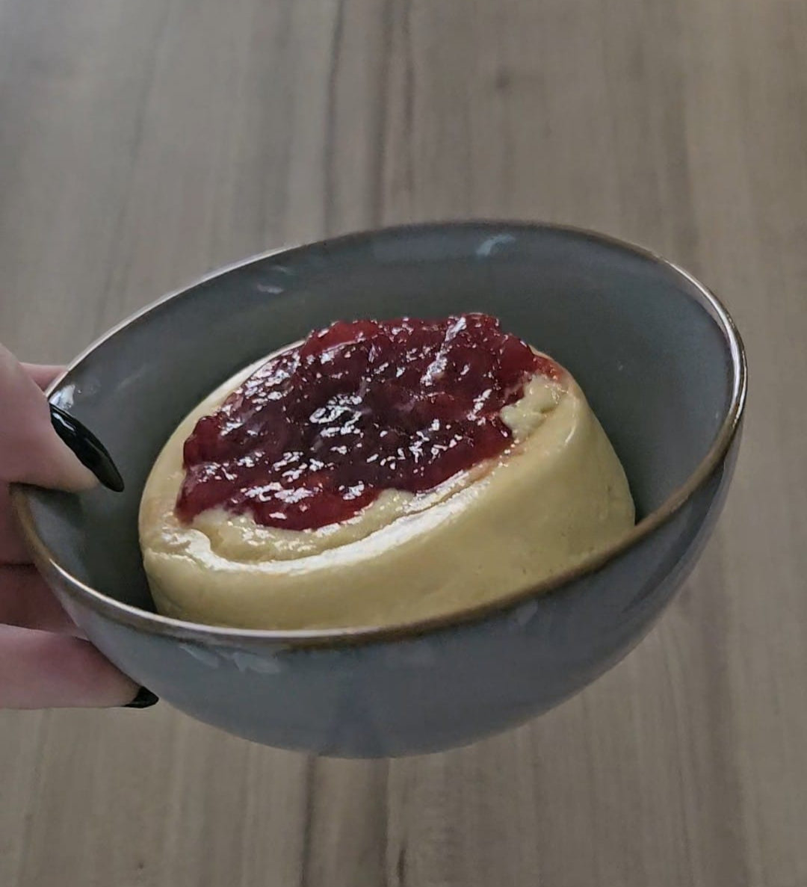

_Fácil, sencilla y riquísima._

> ¿Eres amante de las tartas de queso? Lo sabemos

Es súper fácil de hacer, las cantidades son para 2 personas, pero si las divides puedes hacerte una tarta individual para tus desayunos, postres y meriendas.

Te dejamos la video receta paso a paso, [aquí](https://www.tiktok.com/@vitalittynutri/video/7470488108035804438?is_from_webapp=1&sender_device=pc&web_id=7248299878596494875)

## Tarta de queso fit

## Ingredientes:
- 1 huevo
- 4 cucharadas de queso crema light
- Edulcorante al gusto
- Esencia de vainilla

## Elaboración:
1. Mezcla todos los ingredientes.
2. Bate en la batidora hasta que te quede una mezcla homogénea sin grumos.
3. Vierte en un recipiente apto para microondas.
4. Máxima potencia de 3 a 4 minutos.
5. Deja enfríar
6. Añade mermelada light, sin azúcar o casera
7. ¡Lista!

¡Consejo!

- Deja enfriar la tarta en tu recipiente o desmoldándola. Añade la mermelada casera o light sin azúcar después, al igual que cualquier otro topping como frutos del bosque o fresas.
- Puedes sustituir el queso crema por queso fresco. ¡Atención! necesitará un pelín más de tiempo en el microondas.
