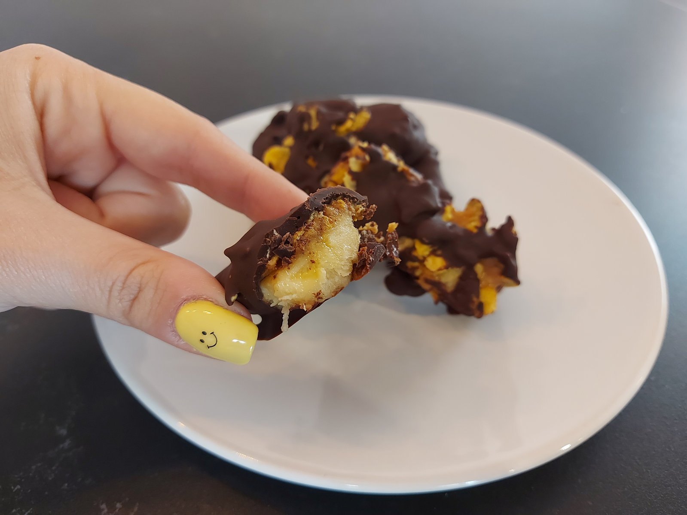
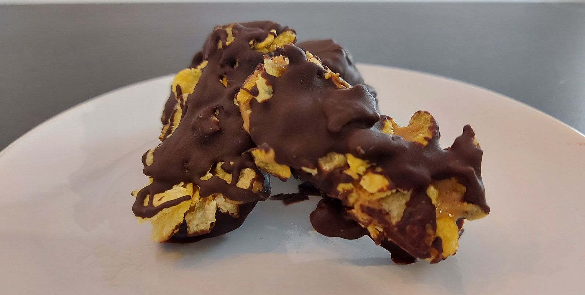

_Un snack perfecto, barritas con muchísimo sabor y saludables_

> Qué buena pinta! – Javier de Lucas.

Es momento de escribir el primer párrafo que tiente a tus lectores. Tanto si se trata de una galleta como de una tarta, toda receta atractiva comienza con una buena historia de origen. Describe cómo se te ocurrió la receta, qué te inspiró, qué es lo que más le gustó a tu familia o amigos, etc. Atrapa a los lectores y muestra tu personalidad siendo abierto y sincero, ¡o incluso divertido! Para entusiasmar al lector, incluye una serie de imágenes indudablemente tentadoras a continuación del primer párrafo.

## Barritas de plátano, mantequilla de cacahuete y chocolate
## Ingredientes:
- 2 plátanos (pequeños o medianos)
- 80-100gr de chocolate puro (+75%)
- Mantequilla de cacahuete
- Copos de maíz o arroz

## Elaboración:
1. Pela los plátanos y córtalos en cuartos como si fueran barcas y reserva en la nevera.
2. Funde el chocolate al microondas en intervalos de 30 segundos (cuidado que no se queme) y atempera en un bol.
3. Unta los trocitos de plátano con mantequilla de cacahuete.
4. Espolvorea por encima los copos de maíz o arroz.
5. Baña las barrita en chocolate y deja que reposen en una bandeja forrada con papel vegetal o en la rejilla de horno.
6. Deja enfriar en el frigorífico hasta que el chocolate se endurezca y si quiere enfriarlos con más rapidez, mete las barritas en el congelador.

Si te animas a hacer estas deliciosas barritas, queremos ver como te han quedado. Puedes hacerle variaciones, como por ejemplo: los copos de maíz por pistachos, la mantequilla de cacahuete por crema de arroz e incluso, puedes sustituir el plátano por cualquier otra fruta, las fresas serían una opción maravillosa.
