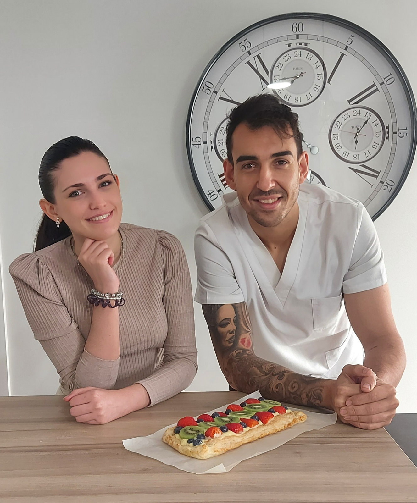

Después de 10 semanas, nuestra compañera en prácticas Laura se despide de nosotros.

Muchos habéis podido conocerla, y comprobar sus ganas de aprender, sus grandes conocimientos y su amor por la nutrición. Estamos seguros que nos preguntaréis que dónde está y por qué se ha ido o ha dejado la recepción tan vacía.

Pues veréis, Laura emprende su último ciclo de prácticas para finalizar su Grado en Nutrición Humana y Dietética en la Universidad Complutense de Madrid , pero esto no es una despedida, seguro que es un hasta luego y volveréis a verla.

Desde aquí, queremos darte todo el apoyo y fuerza que se merece para terminar una etapa de estudio maravillosa. Estamos muy orgullosos de haber podido compartir contigo todos estos días, haberte enseñado un poquito de lo que sabemos y haberte visto disfrutar.

¡Te echaremos de menos! Suerte y a disfrutar, eres y serás una gran profesional de la nutrición.
