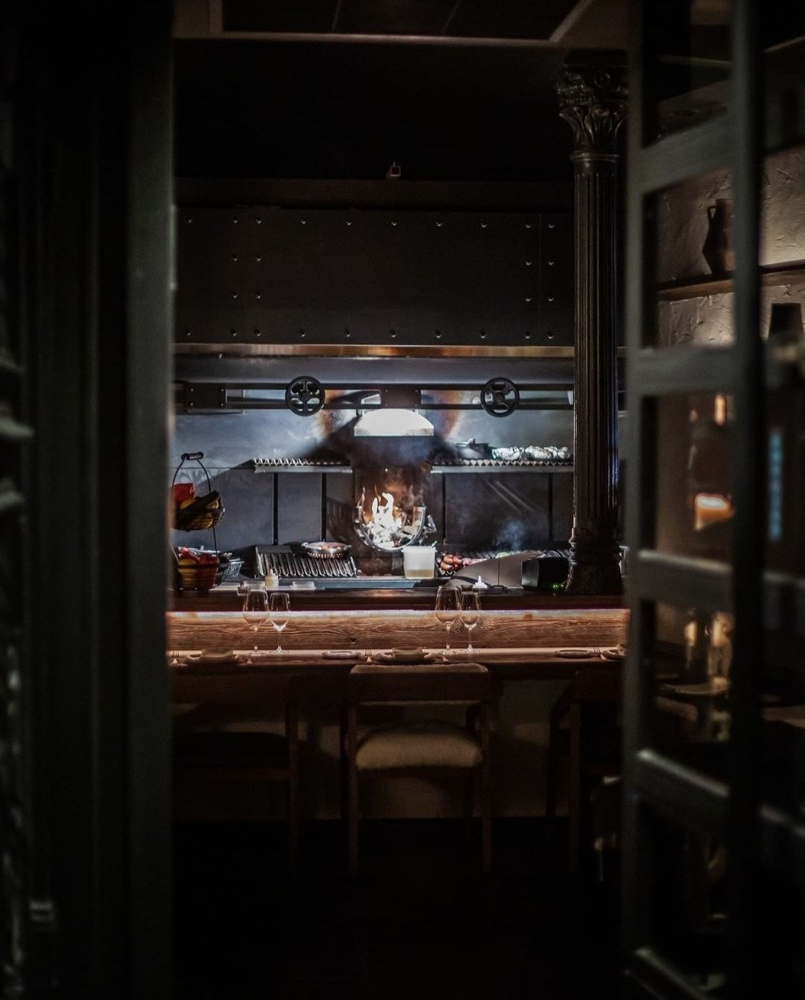

_¡El mejor servicio que hemos visto en mucho tiempo!_

Es íntimo, ideal para una velada tranquila en la que quieras disfrutar con tu pareja o con amigos la comida, el postre y un buen vino.

## Impresiones
Raza Madrid se encuentra en la misma Plaza del Rey. A primera vista parece un lugar oscuro, ya que, la fachada no tiene colores muy llamativos, pero llama muchísimo la atención la luz tenue y cálida que sale del interior. Es un lugar ambientado en el estilo industrial, por lo tanto, combina perfectamente el estilo neoyorkino con negro, madera, ladrillo, cemento y hormigón. Está muy bien decorado y nos llamó mucho la atención una pared completamente llena de botellas de vino, al igual que la cocina vista donde puede verse como se cocinan todos los productos.

Personalmente, ¡nos encantó!

## Experiencia:
[Raza Madrid](https://razamadrid.com/) se divide en tres zonas, la delantera donde puede verse la cocina y la barra, la zona principal donde se encuentra una sala más reservada para grupos o reunión más privada y una zona común que une la zona principal con el final del restaurante.

Te reciben con una copa de champán, y puedes elegir entre distintos panes (si no recuerdo mal, centeno, semillas y payés) para consumir con un aceite maravilloso, de [Palacio de los Olivos](https://olivapalacios.es/). En nuestro caso, este aceite llevaba siendo durante cinco años el mejor del mundo. Pero eso no es todo, también te sirven una crema de verduras templada. ¡Una exquisitez para abrir boca!

## Nuestros platos y opiniones:
**Entrante:** Croquetas de jamón con boletus - (12€)

Ojalá vinieran más croquetas en el plato, estaban de muerte, cremosas por dentro y muy crujientes por fuera. Todo un acierto y para repetir.

**Principales:** Solomillo de vaca (200gr) de 4 a 6 años (Holanda) - (20€) y Lomo alto (300gr) Ojo de Bife (Argentina) - (23€).

Las carnes son su especialidad y no dudábamos que iban a estar perfectas. El servicio nos aconsejó muy bien en función de nuestros gustos, de hecho, el lomo alto íbamos a pedirlo poco hecho y nos aconsejaron que fuera al punto, ellos se encargaban de darle la cocción perfecta para que el producto estuviera jugoso y lo suficientemente hecho para poder degustarlo sin perder nada de sabor. Y efectivamente, acertaron de lleno. Las dos carnes estaban maravillosas.

Como curiosidad, nos explicaron de que parte del animal provenía cada una de las carnes, cual era su textura y su sabor.

**Guarniciones:** Ensalada templada de pimientos asados (8€) y Puré de patata al estilo Robuchón (5€)

Si tuviera que quedarme con una de las guarniciones sin duda sería el puré de patata, no porque la ensalada estuviera mala o fuera una guarnición sin más, si no porque el puré estaba espectacular, tenía un sabor ligero pero a la vez toques salados y su textura era perfecta.

**Postre:** tarta de queso y dulce de leche

Para nada empalagosa, la porción es suficiente para terminar la cena con un toque dulce.

**Bebida:** Vino Blanco José Pariente D. O. Rueda (19€)

[Carta Raza Madrid](https://razamadrid.com/wp-content/uploads/2021/11/Carta-Raza.pdf)

## Puntuación final:
¡Un 10! En primer lugar, recalcar el servicio de las dos personas que nos atendieron, muy amables, atentas y sobre todo con experiencia en hostelería. Un detalle que nos explicaran todo lo relacionado con la carne que íbamos a cenar y un acierto el vino que nos recomendaron.

Es lógico y normal que en las reseñas de Google tengan un 5 sobre 5. Nosotros no podemos sacar ni un pero de nuestra experiencia en Raza Madrid, de hecho, mientras disfrutábamos de la velada, avisamos a unos amigos para volver, probar más platos y repetir sin ninguna duda.
