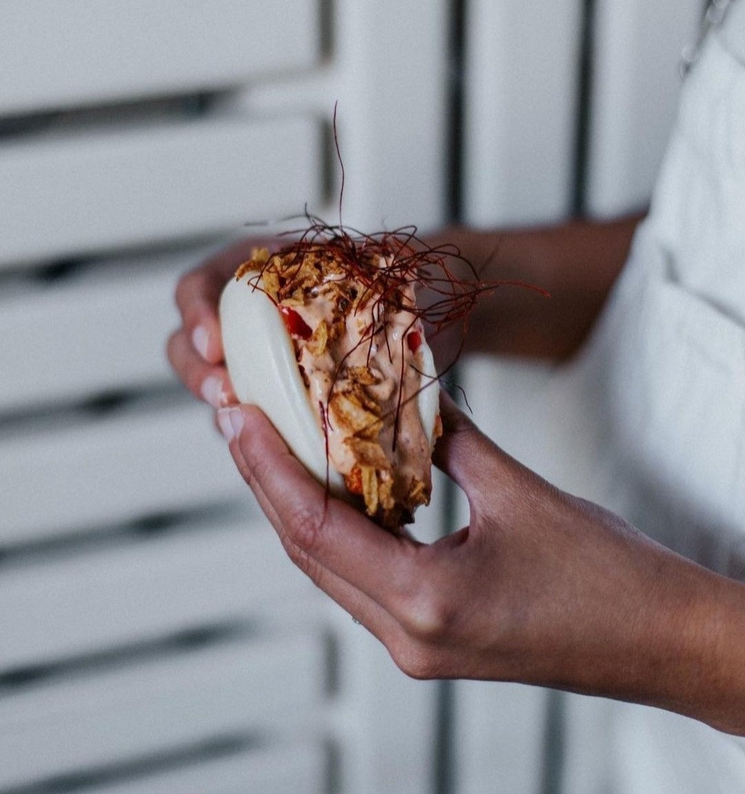

¡Platos distintos y con mucho sabor!

Es ideal para ir con amigos, bastante ambiente, casi todas las mesas llenas y con un promedio de mediana edad.

## Impresiones:
Paipái Madrid se encuentra en la misma Plaza de Perú. Desde fuera llama mucho la atención, ya que, tiene un estilo asiático muy marcado, pero combina lo moderno y clásico a la perfección. Los colores son neutros pero el color azul y amarillo de la fachada te incitan a entrar.

Es un lugar diferente, de cocina creativa y sencilla.

## Experiencia:
[Paipái Madrid](https://paipairestaurante.com/) se divide en tres zonas, una sala principal en la que cenamos nosotros, con grandes ventanales desde donde se puede ver la calle (en nuestra opinión la mesa donde cenamos un poco pequeña), una zona de barra con cocina vista y mesas altas y una zona un poco más apartada que se puede reservar para alguna ocasión especial con amigos, familia o alguna celebración.

Nosotros acudimos un jueves y la verdad que estaba muy lleno, de hecho, reservamos y solo se podía en mesa alta en la parte de la barra y al llegar, nos pasaron a la sala principal, así que lo agradecimos un montón.

Al llegar te ofrecen un aperitivo, unas pequeñas aceitunas y un pan dulce que recuerda al típico pan de pueblo. ¡Muy bueno!

## Nuestros platos y opiniones:
**Entrantes:**

- Maki tempurizado de solomillo de vaca con mayonesa japonesa, salsa Yakitori y boniato crujiente (6.50€)

- Maki de atún, tomate cherry confitado, mayo de curry, salsa agridulce, chutney de mango, cebolla crujiente (6.50€)

En cuanto a los makis, ¡de los mejores que hemos probado! las salsas cremosas y con un sabor espectacular, creo que podríamos haber cenado eligiendo todo el sushi de la carta. Sin duda, volveríamos a repetir.

- Brioche de cordero lechal (5.90€) y Bao de cochinita pibil (5€).

Yo escogí el bao, siempre que hay alguno en carta, lo pido. En este caso, el pan perfecto y la cochinita muy bien condimentada, que dejaba saborear todos los ingredientes. En cuanto al brioche, para mi gusto muy picante, solo le pude dar un bocado. Cuando los platos son muy picantes dejas de saborear los alimentos y apenas sabes que estas comiendo, con un nivel menor de picante, el brioche se disfrutaría más.

**Principales:** Canelón de pato confitado (13€) y Huevo crujiente sobre parmentier de patata y trufa (12€)

Si tuviera que quedarme con alguno de los dos, escogería el canelón, ojalá hubiera sido un poco más grande. El sabor es maravilloso, fuerte, dulce y salado a la vez. El pato del interior venía desmenuzado y estaba bastante bien hecho.

En cuanto al huevo crujiente, la verdad que nos llamó bastante la atención y decidimos arriesgar con esta opción. El emplatado, muy bonito, pero quizás la combinación de texturas entre el crujiente y la _parmentier_ (que venía bastante líquida) quedaba un poco raro, sobre todo cuando cogías con la cuchara ambos alimentos. Pero de sabor, estaba bastante bueno.

**Postre:** Torrija de brioche con helado de leche merengada (6€)

Esponjosa por dentro y caramelizada por fuera, caliente y no demasiado dulce. Combina muy bien con el frescor del helado. ¡Una elección maravillosa!

[Carta PAIPÁI Madrid](https://paipairestaurante.com/menu/)

## Puntuación final:
¡Un 8! Notable. En primer lugar, los platos salieron de uno en uno, pero fue totalmente normal, el local estaba lleno. Para ir con amigos, es totalmente recomendable, si quieres una velada tranquila, evitaría el jueves y el fin de semana.

Lo que más nos gustó sin duda, los makis, si volvemos, escogeremos otros para probarlos todos. Lo que menos nos gustó el huevo crujiente, si la _parmentier_ hubiera estado un poco más compacta, la mezcla hubiera sido excelente.
